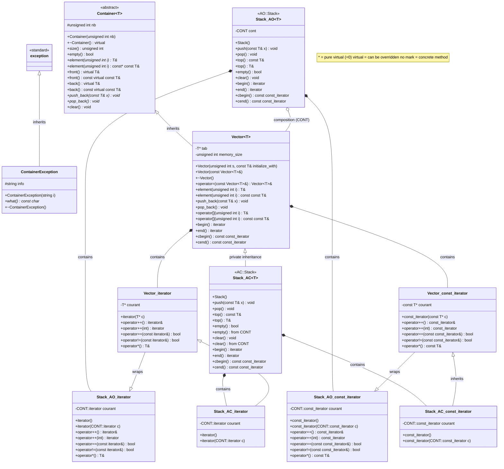
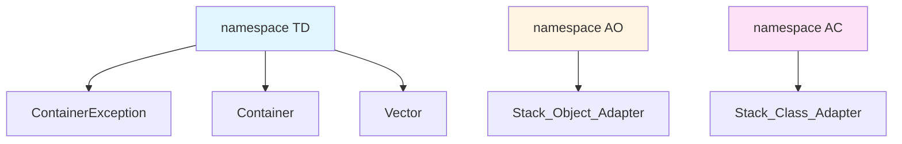

# UML Class Diagram - Ex37 Container System

## Class Diagram



## Namespace Structure



## Design Patterns

### 1. Template Method Pattern
- **Container<T>**: Abstract base class defining the container interface
- **Vector<T>**: Concrete implementation

### 2. Adapter Pattern - Object Adapter (AO namespace)
- **AO::Stack<T>**: Uses composition to wrap a Container (default: Vector<T>)
- Adapts Container interface to Stack interface
- **特点**：
  - 使用组合（composition）：`CONT cont;` 作为成员变量
  - 通过 `cont.push_back()`, `cont.pop_back()` 等调用底层容器方法
  - 更灵活，可以在运行时更换容器
  - 迭代器通过包装（wrapping）底层容器的迭代器实现

### 3. Adapter Pattern - Class Adapter (AC namespace)
- **AC::Stack<T>**: Uses private inheritance from Container (default: Vector<T>)
- Adapts Container interface to Stack interface through inheritance
- **特点**：
  - 使用私有继承（private inheritance）：`class Stack : private CONT`
  - 直接调用基类方法：`CONT::push_back()`, `CONT::pop_back()`
  - 使用 `using CONT::empty;` 和 `using CONT::clear;` 暴露选定的基类方法
  - 更高效（没有额外的对象），但不太灵活
  - 迭代器通过继承（inheritance）底层容器的迭代器实现

### 4. Iterator Pattern
- All container classes provide iterator and const_iterator
- Enables sequential access to elements without exposing internal structure

## Key Relationships

1. **Inheritance**:
   - `ContainerException` inherits from `std::exception`
   - `Vector<T>` inherits from `Container<T>` (public)
   - `AC::Stack<T>` inherits from `CONT` (private, typically Vector<T>)

2. **Composition**:
   - `AO::Stack<T>` contains a `CONT` object (typically Vector<T>)
   - Each container class contains iterator classes

3. **Template Specialization**:
   - All container classes are templated on element type `T`
   - Stack classes are also templated on container type `CONT`

## Virtual Functions Overview

### Container<T> 函数分类表

| 函数类型 | 函数名 | 声明 | 特点 |
|---------|-------|------|------|
| **纯虚函数 (Pure Virtual)** | `element(i)` | `virtual T& element(unsigned int i) = 0;` | 必须在子类中实现 |
| | `element(i) const` | `virtual const T& element(unsigned int i) const = 0;` | 必须在子类中实现 |
| | `push_back(x)` | `virtual void push_back(const T& x) = 0;` | 必须在子类中实现 |
| | `pop_back()` | `virtual void pop_back() = 0;` | 必须在子类中实现 |
| **虚函数 (Virtual)** | `front()` | `virtual T& front();` | 有默认实现，可选重写 |
| | `front() const` | `virtual const T& front() const;` | 有默认实现，可选重写 |
| | `back()` | `virtual T& back();` | 有默认实现，可选重写 |
| | `back() const` | `virtual const T& back() const;` | 有默认实现，可选重写 |
| | 析构函数 | `virtual ~Container()` | 虚析构函数，确保正确析构 |
| **具体方法 (Concrete)** | `size()` | `unsigned int size() const` | 不可重写，直接使用 |
| | `empty()` | `bool empty() const` | 不可重写，直接使用 |
| | `clear()` | `void clear()` | 不可重写，但可重写 pop_back |

### 为什么这样设计？

1. **纯虚函数**：容器的核心操作（访问元素、添加/删除），每个具体容器实现方式不同
2. **虚函数**：基于 `element()` 实现的便利方法，默认实现已足够，但允许优化
3. **具体方法**：通用逻辑（如 `size()` 返回 `nb`），所有容器都一样

## Class Descriptions

### ContainerException
Exception class for container operations, inherits from std::exception.

### Container<T>
Abstract base class (namespace TD) - 抽象容器基类，定义容器接口。详见上方的"Container<T> 函数分类表"。

### Vector<T>
Concrete container implementation (namespace TD) providing:
- Dynamic array with automatic growth (memory_size 机制)
- Random access via `operator[]` and `element()`
- Iterator support (iterator and const_iterator)
- **重写的纯虚函数**：
  - `element(i)` - 带边界检查的数组访问
  - `push_back(x)` - 自动扩容（每次+5）
  - `pop_back()` - 减少 nb 计数
- **未重写的虚函数**：使用 Container 的默认实现
  - `front()`, `back()` - 通过 `element()` 实现

### AO::Stack<T>
Object Adapter implementation of stack (namespace AO):
- Wraps a container object (composition)
- Provides stack interface: `push()`, `pop()`, `top()`
- Wraps container's iterators

### AC::Stack<T>
Class Adapter implementation of stack (namespace AC):
- Privately inherits from container
- Provides stack interface: `push()`, `pop()`, `top()`
- Uses `using` declarations to expose selected base class methods
- Iterators inherit from container's iterators

## Stack 实现方式对比

| 特性 | AO::Stack (对象适配器) | AC::Stack (类适配器) |
|------|----------------------|---------------------|
| **实现方式** | 组合（Composition） | 私有继承（Private Inheritance） |
| **关系** | HAS-A 关系 | IS-A 关系（但私有） |
| **声明** | `CONT cont;` 成员变量 | `class Stack : private CONT` |
| **方法调用** | `cont.push_back(x)` | `CONT::push_back(x)` |
| **内存开销** | 有一个额外的对象成员 | 直接继承，无额外开销 |
| **灵活性** | 高：可以动态选择容器类型 | 低：编译时确定 |
| **暴露基类方法** | 不需要 `using` 声明 | 需要 `using CONT::empty;` 等 |
| **迭代器实现** | 包装基类迭代器 | 继承基类迭代器 |
| **迭代器成员** | `typename CONT::iterator courant;` | 继承后直接使用 |

### 代码示例对比

**AO::Stack - 对象适配器**:
```cpp
template<class T, class CONT=Vector<T>>
class Stack {
    CONT cont;  // 组合：包含一个容器对象
public:
    void push(const T& x) { cont.push_back(x); }  // 委托给成员对象
    void pop() { cont.pop_back(); }
    bool empty() const { return cont.empty(); }
};
```

**AC::Stack - 类适配器**:
```cpp
template<class T, class CONT=Vector<T>>
class Stack : private CONT {  // 私有继承
public:
    void push(const T& x) { CONT::push_back(x); }  // 直接调用基类方法
    void pop() { CONT::pop_back(); }
    using CONT::empty;  // 暴露基类方法
    using CONT::clear;
};
```
