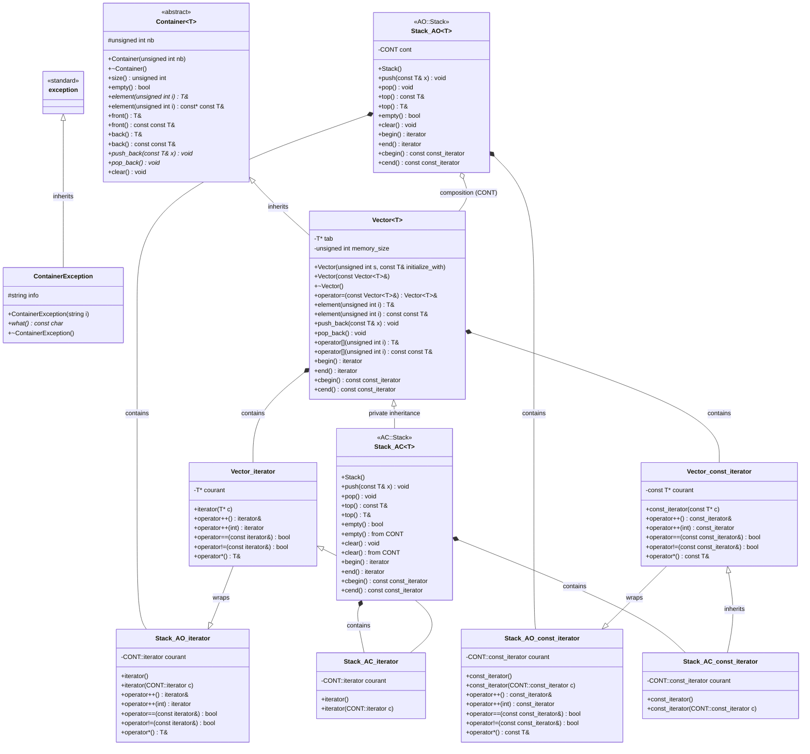
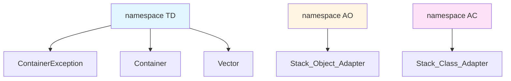

# UML Class Diagram - Ex37 Container System

## Class Diagram

## Namespace Structure

## Design Patterns

### 1. Template Method Pattern
- **Container<T>**: Abstract base class defining the container interface
- **Vector<T>**: Concrete implementation

### 2. Adapter Pattern - Object Adapter (AO namespace)
- **AO::Stack<T>**: Uses composition to wrap a Container (default: Vector<T>)
- Adapts Container interface to Stack interface
- More flexible, uses object composition

### 3. Adapter Pattern - Class Adapter (AC namespace)
- **AC::Stack<T>**: Uses private inheritance from Container (default: Vector<T>)
- Adapts Container interface to Stack interface through inheritance
- More efficient, but less flexible

### 4. Iterator Pattern
- All container classes provide iterator and const_iterator
- Enables sequential access to elements without exposing internal structure

## Key Relationships

1. **Inheritance**:
   - `ContainerException` inherits from `std::exception`
   - `Vector<T>` inherits from `Container<T>` (public)
   - `AC::Stack<T>` inherits from `CONT` (private, typically Vector<T>)

2. **Composition**:
   - `AO::Stack<T>` contains a `CONT` object (typically Vector<T>)
   - Each container class contains iterator classes

3. **Template Specialization**:
   - All container classes are templated on element type `T`
   - Stack classes are also templated on container type `CONT`

## Class Descriptions

### ContainerException
Exception class for container operations, inherits from std::exception.

### Container<T>
Abstract base class (namespace TD) providing:
- Pure virtual methods: `element()`, `push_back()`, `pop_back()`
- Virtual methods: `front()`, `back()`
- Concrete methods: `size()`, `empty()`, `clear()`

### Vector<T>
Concrete container implementation (namespace TD) providing:
- Dynamic array with automatic growth
- Random access via `operator[]` and `element()`
- Iterator support (iterator and const_iterator)

### AO::Stack<T>
Object Adapter implementation of stack (namespace AO):
- Wraps a container object (composition)
- Provides stack interface: `push()`, `pop()`, `top()`
- Wraps container's iterators

### AC::Stack<T>
Class Adapter implementation of stack (namespace AC):
- Privately inherits from container
- Provides stack interface: `push()`, `pop()`, `top()`
- Uses `using` declarations to expose selected base class methods
- Iterators inherit from container's iterators
