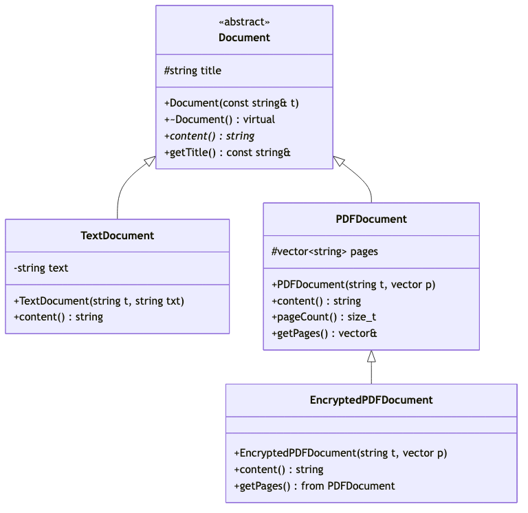
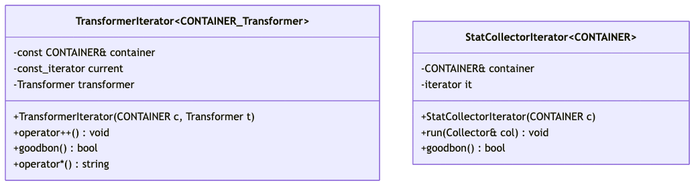
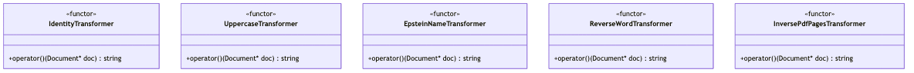
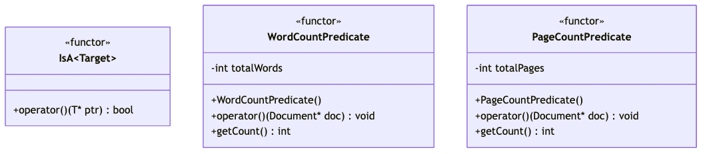
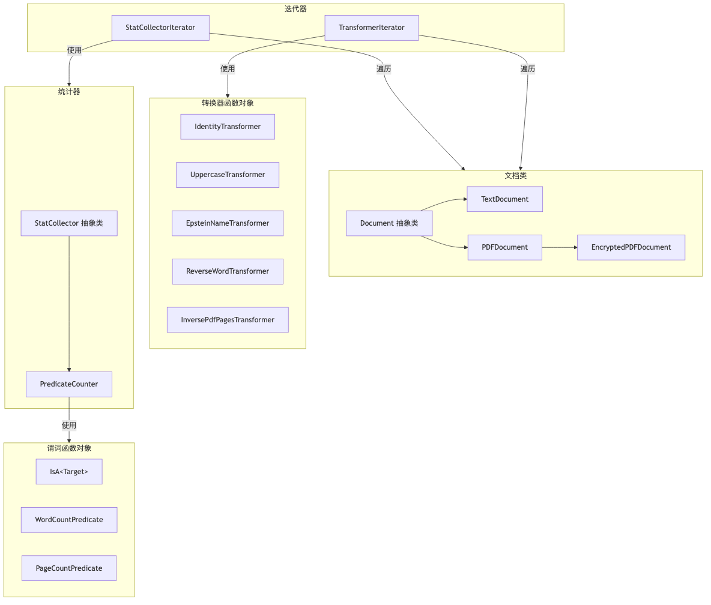

## UML 类图（分模块展示）

为便于理解和打印，UML图按功能模块分为6个部分：

### 图1: Document 继承层次结构
展示文档类的继承关系：抽象基类 Document 及其三个派生类。



### 图2: StatCollector 继承层次
展示统计器的继承关系：抽象基类 StatCollector 和使用策略模式的 PredicateCounter。


### 图3: Iterator 类
展示两个迭代器类：TransformerIterator（转换迭代器）和 StatCollectorIterator（统计迭代器）。



### 图4: Transformer 函数对象族
展示5种转换器函数对象，它们都实现 `operator()(Document* doc)`。



### 图5: Predicate 函数对象族
展示3种谓词函数对象，用于类型检查和统计。



### 图6: 整体关系图（简化）
展示所有模块之间的关系：文档、转换器、谓词、迭代器、统计器。



---

## Document.h
文档类层次结构：抽象基类 Document 及其派生类

```cpp
#ifndef DOCUMENT_H
#define DOCUMENT_H

#include <string>
#include <vector>
#include <ostream>

/* ===============================
 * 抽象基类：Document
 * =============================== */
class Document {
protected:
    std::string title;

public:
    Document(const std::string& t) : title(t) {}
    virtual ~Document() {}

    virtual std::string content() const = 0;

    const std::string& getTitle() const { return title; }
};

/* ===============================
 * TextDocument
 * =============================== */
class TextDocument : public Document {
    std::string text;

public:
    TextDocument(const std::string& t, const std::string& txt)
        : Document(t), text(txt) {}

    std::string content() const override {
        return text;
    }
};

/* ===============================
 * PDFDocument
 * =============================== */
class PDFDocument : public Document {
protected:
    std::vector<std::string> pages;

public:
    PDFDocument(const std::string& t,
                const std::vector<std::string>& p)
        : Document(t), pages(p) {}

    std::string content() const override {
        std::string result;
        for (std::size_t i = 0; i < pages.size(); ++i) {
            result += "Page ";
            result += std::to_string(i + 1);
            result += ": ";
            result += pages[i];
            result += "; ";
        }
        return result;
    }

    std::size_t pageCount() const {
        return pages.size();
    }

    std::vector<std::string>& getPages() {
        return pages;
    }

    const std::vector<std::string>& getPages() const {
        return pages;
    }
};

/* ===============================
 * EncryptedPDFDocument
 * =============================== */
class EncryptedPDFDocument : public PDFDocument {
public:
    EncryptedPDFDocument(const std::string& t,
                         const std::vector<std::string>& p)
        : PDFDocument(t, p) {}

    std::string content() const override {
        return "[ENCRYPTED PDF CONTENT]";
    }

    // 继承 getPages()，仍然可以统计页数
    using PDFDocument::getPages;
};

#endif
```

**关键点**：
- `Document` 是抽象基类，纯虚函数 `content()`
- `TextDocument` 存储纯文本
- `PDFDocument` 存储页面向量
- `EncryptedPDFDocument` 重写 `content()` 返回加密提示

---

## StatCollectors.h
统计器抽象基类和谓词计数器

```cpp
#ifndef STAT_COLLECTORS_H
#define STAT_COLLECTORS_H

// ===========================
// 抽象统计器
// ===========================
template<class T>
class StatCollector {
public:
    virtual ~StatCollector() = default;
    virtual void process(T* ptr) = 0;
};

// ============================================
// PredicateCounter
// 使用"谓词对象"的统计器
// ============================================
template<class T, class Predicate>
class PredicateCounter : public StatCollector<T> {
    Predicate pred;
    int count;

public:
    PredicateCounter(const Predicate& p)
        : pred(p), count(0) {}

    void process(T* ptr) override {
        if (pred(ptr)) {   // ⭐ 这里正是 operator()
            ++count;
        }
    }

    int getCount() const {
        return count;
    }
};

#endif
```

**关键点**：
- `StatCollector<T>` 是抽象基类，定义统计框架
- `PredicateCounter` 使用谓词对象作为策略
- 在 `process()` 中调用谓词的 `operator()`

---

## Predicates.h
各种谓词函数对象

```cpp
#ifndef PREDICATES_H
#define PREDICATES_H

#include "Document.h"

// ===============================
// 通用谓词对象 IsA<Target>
// ===============================
template<class Target>
class IsA {
public:
    template<class T>
    bool operator()(T* ptr) const {
        return dynamic_cast<Target*>(ptr) != nullptr;
    }
};

// ===============================
// 统计文本单词数的谓词
// 仅对 TextDocument 有效
// ===============================
class WordCountPredicate {
    int totalWords;
public:
    WordCountPredicate() : totalWords(0) {}

    void operator()(Document* doc) {
        TextDocument* td = dynamic_cast<TextDocument*>(doc);
        if (!td) return;

        std::istringstream iss(td->content());
        std::string word;
        while (iss >> word) ++totalWords;
    }

    int getCount() const { return totalWords; }
};

// ===============================
// 统计 PDF 页数的谓词
// 仅对 PDFDocument 或 EncryptedPDFDocument 有效
// ===============================
class PageCountPredicate {
    int totalPages;
public:
    PageCountPredicate() : totalPages(0) {}

    void operator()(Document* doc) {
        PDFDocument* pdf = dynamic_cast<PDFDocument*>(doc);
        EncryptedPDFDocument* epdf = dynamic_cast<EncryptedPDFDocument*>(doc);
        if (pdf) totalPages += pdf->getPages().size();
        else if (epdf) totalPages += epdf->getPages().size();
    }

    int getCount() const { return totalPages; }
};

#endif
```

**关键点**：
- `IsA<Target>` 使用 `dynamic_cast` 进行类型检查
- `WordCountPredicate` 和 `PageCountPredicate` 内部维护计数状态
- 所有谓词都实现 `operator()`，是函数对象

---

## TransformerIterator.h
转换迭代器：遍历容器并应用转换

```cpp
#ifndef TRANSFORMER_ITERATOR_H
#define TRANSFORMER_ITERATOR_H

#include <string>

template <class CONTAINER, class Transformer>
class TransformerIterator
{
private:
    // CONTAINER 泛型到时候应该就是 vector
    const CONTAINER &container;
    typename CONTAINER::const_iterator current;
    Transformer transformer;

public:
    TransformerIterator(const CONTAINER &c, Transformer t)
        : container(c), current(container.begin()), transformer(t) {}

    void operator++()
    {
        ++current;
    }

    bool goodbon() const
    {
        return current != container.end();
    }

    std::string operator*() const
    {
        return transformer(*current);
    }
};

#endif
```

**关键点**：
- 泛型设计：`CONTAINER` 和 `Transformer` 都是模板参数
- `operator*()` 调用 `transformer(*current)` 进行转换
- 不修改原始容器，只返回转换结果

---

## StatCollectorIterator.h
统计迭代器：遍历容器并应用统计器

```cpp
#ifndef STATCOLLECTORITERATOR_H
#define STATCOLLECTORITERATOR_H

#include <iterator>

template<class CONTAINER>
class StatCollectorIterator {
    CONTAINER& container;
    typename CONTAINER::iterator it;
public:
    StatCollectorIterator(CONTAINER& c)
        : container(c), it(container.begin()) {}

    template<class Collector>
    void run(Collector& col) {
        for (it = container.begin(); it != container.end(); ++it) {
            col.process(*it);
        }
    }

    bool goodbon() const {
        return it != container.end();
    }
};

#endif
```

**关键点**：
- `run()` 方法接受任何实现了 `process()` 的统计器
- 遍历整个容器，对每个元素调用 `col.process()`
- 统计结果累积在 Collector 对象中

---

## Transformers.h
各种转换器函数对象

```cpp
#ifndef TRANSFORMERS_H
#define TRANSFORMERS_H

#include "Document.h"
#include <algorithm>
#include <sstream>

/* ========= 工具函数 ========= */

// 不需要掌握
std::string toUpper(const std::string& s) {
    std::string r = s;
    for (std::string::iterator it = r.begin(); it != r.end(); ++it) {
        if (*it >= 'a' && *it <= 'z') {
            *it = *it - 'a' + 'A';
        }
    }
    return r;
}

// 不需要掌握
std::string reverseWords(const std::string& s) {
    std::istringstream iss(s);
    std::ostringstream oss;
    std::string word;

    bool first = true;
    while (iss >> word) {
        std::reverse(word.begin(), word.end());
        if (!first) oss << " ";
        oss << word;
        first = false;
    }
    return oss.str();
}

/* ============================================================
 * Transformer 0：IdentityTransformer
 * 任意 Document → 原始 content()
 * ============================================================ */

class IdentityTransformer {
public:
    std::string operator()(Document* doc) const {
        if (!doc) return "";
        return doc->content();
    }
};

/* ============================================================
 * Transformer 1：大写（仅 TextDocument）
 * ============================================================ */

class UppercaseTransformer {
public:
    std::string operator()(Document* doc) const {
        TextDocument* td = dynamic_cast<TextDocument*>(doc);
        if (!td) return "NOT A TEXT FILE";
        return toUpper(td->content());
    }
};

/* ============================================================
 * Transformer 2：Epstein 替换规则（仅 TextDocument）
 * ============================================================ */

class EpsteinNameTransformer {
public:
    std::string operator()(Document* doc) const {
        TextDocument* td = dynamic_cast<TextDocument*>(doc);
        if (!td) return "NOT A TEXT FILE";

        std::string txt = td->content();

        if (txt == "Trump") {
            return "MR.BUNNY";
        }
        if (txt == "Clinton") {
            return "MR.RABBIT";
        }
        return txt;
    }
};

/* ============================================================
 * Transformer 3：单词反转（仅 TextDocument）
 * ============================================================ */

class ReverseWordTransformer {
public:
    std::string operator()(Document* doc) const {
        TextDocument* td = dynamic_cast<TextDocument*>(doc);
        if (!td) return "NOT A TEXT FILE";
        return reverseWords(td->content());
    }
};

/* ============================================================
 * Transformer 4：InversePdfPagesTransformer（就地修改）
 * PDF / EncryptedPDF 都适用
 * 直接反转 pdf->pages
 * ============================================================ */

class InversePdfPagesTransformer {
public:
    std::string operator()(Document* doc) const {
        auto* pdf = dynamic_cast<PDFDocument*>(doc);
        if (!pdf) return "NOT A PDF FILE";

        auto& pages = pdf->getPages();
        std::reverse(pages.begin(), pages.end());

        return pdf->content();
    }
};

#endif
```

**关键点**：
- 所有 Transformer 都实现 `operator()(Document* doc)`
- 大部分使用 `dynamic_cast` 检查类型
- `IdentityTransformer` 对所有类型有效
- 其他 Transformer 针对特定文档类型
- `InversePdfPagesTransformer` 是唯一会修改原始文档的转换器

---

## 设计模式总结

### 1. 策略模式（Strategy Pattern）
- **Transformer 函数对象族**：可互换的转换算法
- **Predicate 函数对象族**：可互换的判断/统计策略

### 2. 迭代器模式（Iterator Pattern）
- **TransformerIterator**：遍历并转换
- **StatCollectorIterator**：遍历并统计

### 3. 模板方法模式（Template Method Pattern）
- **StatCollector**：定义统计框架
- **PredicateCounter**：使用谓词策略实现具体统计

### 4. 函数对象模式（Functor）
- 所有 Transformer 和 Predicate 都是函数对象
- 可以携带状态（如 PredicateCounter 的 count）
- 类型安全且可内联优化

### 5. 继承层次
```
Document (abstract)
  ├── TextDocument
  └── PDFDocument
        └── EncryptedPDFDocument

StatCollector<T> (abstract)
  └── PredicateCounter<T, Predicate>
```

---

## 使用示例

### 示例 1：使用 TransformerIterator
```cpp
vector<Document*> docs = { /* ... */ };

// 创建转换迭代器
TransformerIterator<vector<Document*>, UppercaseTransformer>
    it(docs, UppercaseTransformer());

// 遍历并输出转换结果
while (it.goodbon()) {
    cout << *it << endl;  // 自动调用 transformer(*current)
    ++it;
}
```

### 示例 2：使用 StatCollectorIterator
```cpp
// 创建统计迭代器
StatCollectorIterator<vector<Document*>> statIt(docs);

// 统计 TextDocument 数量
PredicateCounter<Document, IsA<TextDocument>>
    counter(IsA<TextDocument>{});

// 运行统计
statIt.run(counter);
cout << "Count: " << counter.getCount() << endl;
```