# UML Class Diagram - cpp-from-teacher 文档处理系统

## 整体架构

这是一个文档处理系统，展示了以下设计模式：
- **策略模式（Strategy Pattern）**：Transformer 函数对象
- **迭代器模式（Iterator Pattern）**：TransformerIterator 和 StatCollectorIterator
- **模板方法模式（Template Method Pattern）**：StatCollector
- **函数对象模式（Function Object/Functor）**：所有 Transformer 和 Predicate

## 类图

```mermaid
classDiagram
    %% Document 层次结构
    class Document {
        <<abstract>>
        #string title
        +Document(const string& t)
        +~Document() virtual
        +content() string*
        +getTitle() const string&
    }
    note for Document "纯虚函数 content()"

    class TextDocument {
        -string text
        +TextDocument(const string& t, const string& txt)
        +content() string
    }

    class PDFDocument {
        #vector~string~ pages
        +PDFDocument(const string& t, const vector~string~& p)
        +content() string
        +pageCount() size_t
        +getPages() vector~string~&
        +getPages() const const vector~string~&
    }

    class EncryptedPDFDocument {
        +EncryptedPDFDocument(const string& t, const vector~string~& p)
        +content() string
        +getPages() from PDFDocument
    }

    %% StatCollector 层次结构
    class StatCollector~T~ {
        <<abstract>>
        +~StatCollector() virtual
        +process(T* ptr)* void
    }
    note for StatCollector~T~ "纯虚函数 process()"

    class PredicateCounter~T_Predicate~ {
        -Predicate pred
        -int count
        +PredicateCounter(const Predicate& p)
        +process(T* ptr) void
        +getCount() int
    }

    %% Iterator 类
    class TransformerIterator~CONTAINER_Transformer~ {
        -const CONTAINER& container
        -CONTAINER::const_iterator current
        -Transformer transformer
        +TransformerIterator(const CONTAINER& c, Transformer t)
        +operator++() void
        +goodbon() bool
        +operator*() string
    }
    note for TransformerIterator~CONTAINER_Transformer~ "使用 Transformer 函数对象\n遍历并转换容器元素"

    class StatCollectorIterator~CONTAINER~ {
        -CONTAINER& container
        -CONTAINER::iterator it
        +StatCollectorIterator(CONTAINER& c)
        +run(Collector& col) void
        +goodbon() bool
    }
    note for StatCollectorIterator~CONTAINER~ "遍历容器并应用统计器"

    %% Transformer 函数对象
    class IdentityTransformer {
        <<functor>>
        +operator()(Document* doc) string
    }
    note for IdentityTransformer "返回原始内容"

    class UppercaseTransformer {
        <<functor>>
        +operator()(Document* doc) string
    }
    note for UppercaseTransformer "转换为大写\n仅对 TextDocument"

    class EpsteinNameTransformer {
        <<functor>>
        +operator()(Document* doc) string
    }
    note for EpsteinNameTransformer "替换特定名字\n仅对 TextDocument"

    class ReverseWordTransformer {
        <<functor>>
        +operator()(Document* doc) string
    }
    note for ReverseWordTransformer "反转单词\n仅对 TextDocument"

    class InversePdfPagesTransformer {
        <<functor>>
        +operator()(Document* doc) string
    }
    note for InversePdfPagesTransformer "反转 PDF 页面顺序\n就地修改"

    %% Predicate 函数对象
    class IsA~Target~ {
        <<functor>>
        +operator()(T* ptr) bool
    }
    note for IsA~Target~ "类型检查谓词\n使用 dynamic_cast"

    class WordCountPredicate {
        <<functor>>
        -int totalWords
        +WordCountPredicate()
        +operator()(Document* doc) void
        +getCount() int
    }
    note for WordCountPredicate "统计文本单词数\n仅对 TextDocument"

    class PageCountPredicate {
        <<functor>>
        -int totalPages
        +PageCountPredicate()
        +operator()(Document* doc) void
        +getCount() int
    }
    note for PageCountPredicate "统计 PDF 页数\n对 PDF 和加密 PDF"

    %% 继承关系
    Document <|-- TextDocument : inherits
    Document <|-- PDFDocument : inherits
    PDFDocument <|-- EncryptedPDFDocument : inherits

    StatCollector~T~ <|-- PredicateCounter~T_Predicate~ : inherits

    %% 使用关系
    TransformerIterator~CONTAINER_Transformer~ ..> IdentityTransformer : uses
    TransformerIterator~CONTAINER_Transformer~ ..> UppercaseTransformer : uses
    TransformerIterator~CONTAINER_Transformer~ ..> EpsteinNameTransformer : uses
    TransformerIterator~CONTAINER_Transformer~ ..> ReverseWordTransformer : uses
    TransformerIterator~CONTAINER_Transformer~ ..> InversePdfPagesTransformer : uses

    PredicateCounter~T_Predicate~ o-- IsA~Target~ : contains
    PredicateCounter~T_Predicate~ o-- WordCountPredicate : contains
    PredicateCounter~T_Predicate~ o-- PageCountPredicate : contains

    StatCollectorIterator~CONTAINER~ ..> StatCollector~T~ : uses

    TransformerIterator~CONTAINER_Transformer~ ..> Document : transforms
    StatCollectorIterator~CONTAINER~ ..> Document : processes
```



## 设计模式详解

### 1. 策略模式（Strategy Pattern）

**Transformer 函数对象族**：
- 定义了一系列可互换的算法（转换策略）
- 每个 Transformer 都实现 `operator()(Document* doc)`
- `TransformerIterator` 可以使用任何 Transformer

**使用示例**：
```cpp
// 可以灵活切换不同的转换策略
TransformerIterator<vector<Document*>, UppercaseTransformer> upperIt(docs, UppercaseTransformer());
TransformerIterator<vector<Document*>, ReverseWordTransformer> reverseIt(docs, ReverseWordTransformer());
```

### 2. 迭代器模式（Iterator Pattern）

**两种迭代器**：

#### TransformerIterator
- 遍历容器并应用转换
- 返回转换后的字符串
- 不修改原始容器

#### StatCollectorIterator
- 遍历容器并应用统计器
- 统计信息累积在 Collector 中
- 支持多种统计策略

### 3. 函数对象模式（Functor Pattern）

**三类函数对象**：

#### Transformer 函数对象
- `operator()(Document* doc) -> string`
- 转换文档内容

#### Predicate 函数对象
- `operator()(Document* doc) -> bool` （IsA）
- `operator()(Document* doc) -> void` （统计类谓词）
- 判断或统计文档特性

### 4. 模板方法模式（Template Method Pattern）

**StatCollector 层次结构**：
- 定义统计的框架（抽象基类）
- 具体统计逻辑由子类实现
- `PredicateCounter` 使用谓词对象作为策略

## 核心组件说明

### Document 家族

| 类 | 说明 | 特点 |
|---|------|------|
| **Document** | 抽象基类 | 纯虚函数 `content()` |
| **TextDocument** | 文本文档 | 存储纯文本 |
| **PDFDocument** | PDF 文档 | 存储页面数组 |
| **EncryptedPDFDocument** | 加密 PDF | 重写 `content()` 返回加密标识 |

### Transformer 函数对象

| Transformer | 适用类型 | 功能 |
|------------|---------|------|
| **IdentityTransformer** | 所有 Document | 返回原始内容 |
| **UppercaseTransformer** | TextDocument | 转为大写 |
| **EpsteinNameTransformer** | TextDocument | 替换特定名字 |
| **ReverseWordTransformer** | TextDocument | 反转每个单词 |
| **InversePdfPagesTransformer** | PDFDocument 及子类 | 反转页面顺序（就地修改） |

### Predicate 函数对象

| Predicate | 功能 | 返回类型 |
|-----------|------|---------|
| **IsA\<Target\>** | 类型检查（使用 dynamic_cast） | bool |
| **WordCountPredicate** | 统计文本单词数 | void（内部累积） |
| **PageCountPredicate** | 统计 PDF 页数 | void（内部累积） |

## 关键技术点

### 1. 泛型编程
```cpp
// TransformerIterator 是高度泛型的
template <class CONTAINER, class Transformer>
class TransformerIterator { ... }

// 可以用于任何容器和任何 Transformer
```

### 2. 函数对象 vs 函数指针
函数对象的优势：
- 可以携带状态（如 PredicateCounter 的 count）
- 可以被内联优化
- 类型安全

### 3. dynamic_cast 的使用
```cpp
// IsA 使用 dynamic_cast 检查类型
template<class Target>
class IsA {
    bool operator()(T* ptr) const {
        return dynamic_cast<Target*>(ptr) != nullptr;
    }
};
```

### 4. 模板参数化策略
```cpp
// PredicateCounter 将谓词作为模板参数
template<class T, class Predicate>
class PredicateCounter : public StatCollector<T> {
    Predicate pred;  // 策略对象
    // ...
};
```

## 使用场景示例

### 场景 1：转换所有文档
```cpp
vector<Document*> docs = { /* ... */ };

// 使用大写转换器
TransformerIterator<vector<Document*>, UppercaseTransformer>
    it(docs, UppercaseTransformer());

while (it.goodbon()) {
    cout << *it << endl;  // 输出转换后的内容
    ++it;
}
```

### 场景 2：统计特定类型文档数量
```cpp
StatCollectorIterator<vector<Document*>> statIt(docs);

// 统计 TextDocument 数量
PredicateCounter<Document, IsA<TextDocument>>
    counter(IsA<TextDocument>{});

statIt.run(counter);
cout << "TextDocument count: " << counter.getCount() << endl;
```

### 场景 3：链式转换
可以组合多个 Transformer（需要实现组合机制）：
```cpp
// 先转大写，再反转单词
// 这需要创建一个组合 Transformer
```

## 扩展性分析

### 容易扩展的部分

1. **新的文档类型**：
   - 继承 `Document` 并实现 `content()`
   - 无需修改现有代码

2. **新的 Transformer**：
   - 创建新的函数对象类
   - 实现 `operator()(Document* doc)`

3. **新的 Predicate**：
   - 创建新的函数对象类
   - 实现 `operator()()`

4. **新的统计器**：
   - 继承 `StatCollector`
   - 实现 `process()`

### 设计优势

1. **开闭原则**：对扩展开放，对修改关闭
2. **单一职责**：每个类只负责一个功能
3. **依赖倒置**：依赖抽象（Document、StatCollector）而非具体类
4. **策略可替换**：可以在运行时选择不同的策略

## 类关系总结

```
继承关系：
Document
  ├── TextDocument
  └── PDFDocument
        └── EncryptedPDFDocument

StatCollector<T>
  └── PredicateCounter<T, Predicate>

使用关系：
TransformerIterator ---uses---> Transformer 函数对象
StatCollectorIterator ---uses---> StatCollector
PredicateCounter ---contains---> Predicate 函数对象
```
